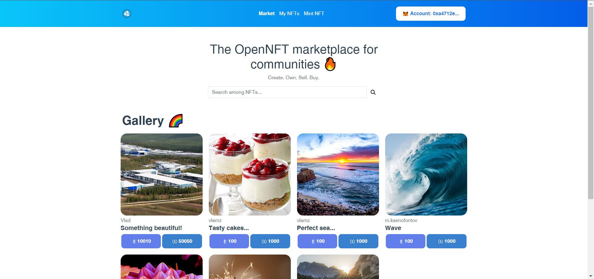

# vue-opennft-front-end

Front-end part for the project **Yet Another NFT Marketplace**.

This platform allows you to buy NFTs and to look at your collection. This project is built using Web3.



## How to run?

*IMPORTANT*: You should have pre-installed `Node.js`(v16.15.1) and `npm`(v8.11.0).

Navigate to `.env` file and fill `VUE_APP_MORALIS_API_KEY` with your `Moralis` API key:
```dotenv
VUE_APP_MORALIS_API_KEY=<YOUR_API_KEY>
# Address of the Open NFT contract
VUE_APP_WEB3_CONTRACT_ADDRESS=0x780a891C0B8a359a8708b66E47cC75EcDe495cE3
# Address of the USDC contract
VUE_APP_WEB3_USDC_CONTRACT_ADDRESS=0x98339D8C260052B7ad81c28c16C0b98420f2B46a
```

#### Project setup
```
npm install
```

#### Compiles and hot-reloads for development
```
npm run serve
```

#### Compiles and minifies for production
```
npm run build
```

### Technology Stack

This project is written in `JavaScript` with the use of `Vue 3`.


